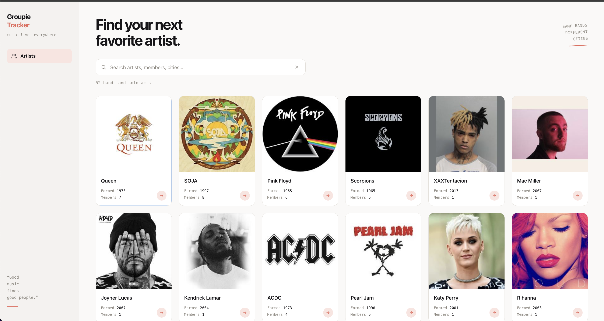

# Groupie Tracker

A website about music bands: line-up, creation year, first album and concert
geography. Data comes from the [Groupie Trackers API](https://groupietrackers.herokuapp.com/api).

The backend is written in Go using the standard library only.

**Live demo:** https://groupie-tracker-t3is.onrender.com



## Running

```bash
go run ./cmd/web
```

The site opens at http://localhost:8080

To change the port:

```bash
go run ./cmd/web -addr :3000
```

Run it from the project root — template and static paths are relative.

## Tests

```bash
go test ./...
go test -race ./...
```

53 tests, none of which call the external API — a local `httptest.Server`
is used instead.

## API Structure

The application consumes the [Groupie Trackers API](https://groupietrackers.herokuapp.com/api) which consists of four main endpoints:

- **artists** — band/artist information (names, image, creation year, first album date, members)
- **locations** — last and upcoming concert locations
- **dates** — last and upcoming concert dates
- **relation** — links artists with their concert dates and locations

## Features

- **Home** — grid of all artists with data visualization
- **Artist page** — photo, members, creation year, first album,
  and a "city → concert dates" table
- **Search** by band name with live suggestions — real-time client-server event: while typing, 
  the browser requests `/suggest?q=...` and shows matches without reloading the page 
  (demonstrates client-initiated request-response communication)
- **Advanced filters** — filter artists by:
  - Creation year range (from-to sliders)
  - First album date range (from-to sliders)
  - Number of band members (range slider with count display)
  - Concert locations (searchable checklist, collapsible, "show more")
  - Sorting (by name ascending/descending, by creation year)
- **Responsive design** — collapsible filter panel on mobile, full sidebar on desktop
- **Debounced filter application** — filters update results asynchronously without page reload

## Structure

```
cmd/web/          entry point: flags, dependency wiring, graceful shutdown
internal/
  models/         API data types
  api/
    client.go     HTTP client: discovery, four endpoints, timeouts
    cache.go      in-memory storage, search
  server/
    server.go     routes, template parsing, rendering
    handlers.go   page handlers
    errors.go     error pages
    middleware.go panic recovery
    format.go     location and date formatting
web/
  templates/      HTML templates
  static/         CSS and JS
```

## How it works

On startup the program requests the API root document, reads the addresses of
the four endpoints, loads `artists`, `locations`, `dates` and `relation`, and
stores them in memory. After that the site serves everything from the cache —
the external API is never called again, so pages load instantly and stay
available even if herokuapp goes down.

Data from `relation` fills the concert table on the artist page;
`locations` and `dates` are used by the search.

## Error handling

| situation | response |
|---|---|
| `/artist/abc` | 400 |
| `/artist/9999` | 404 |
| unknown path | 404 |
| POST, PUT, DELETE | 405 |
| panic in a handler | 500, server keeps running |

The server shuts down gracefully on `Ctrl+C` or `SIGTERM`: it stops accepting
new requests and waits for the in-flight ones to finish.

## Requirements

Go 1.22 or newer (path parameters in `net/http` routing are used).
No external dependencies.
